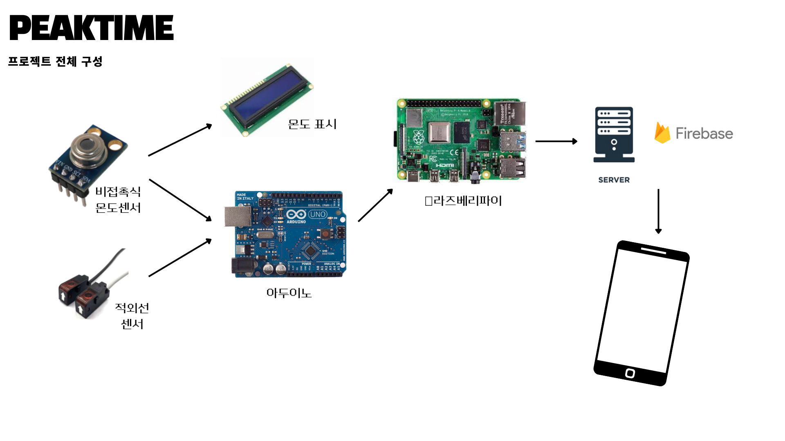
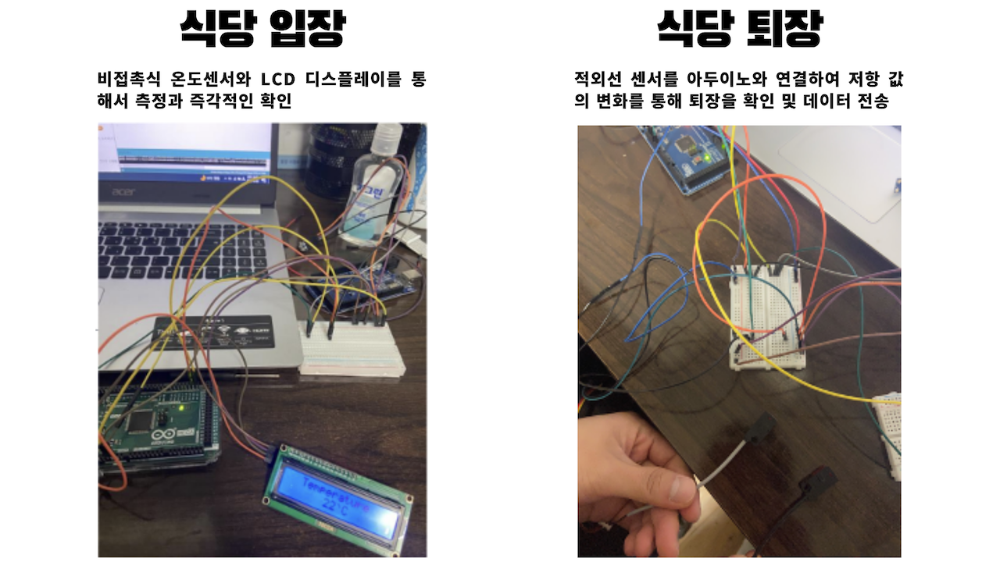
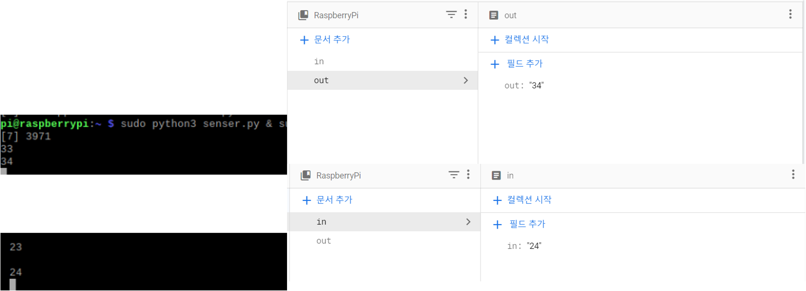
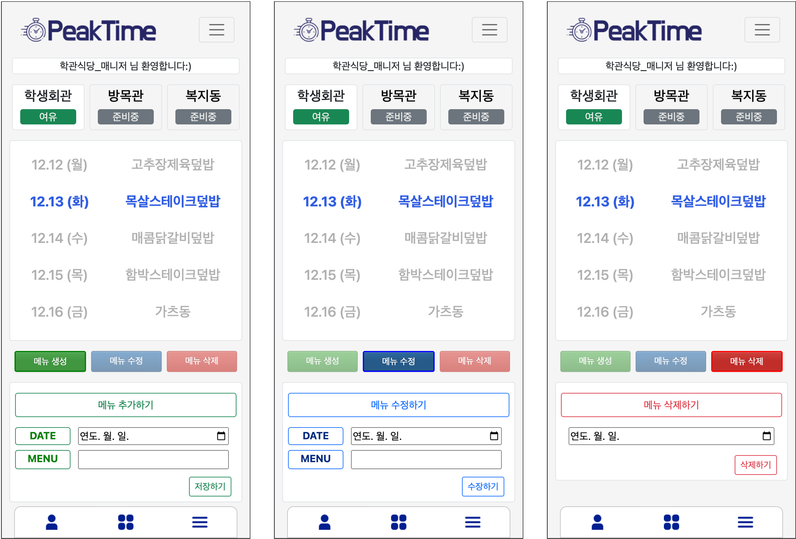
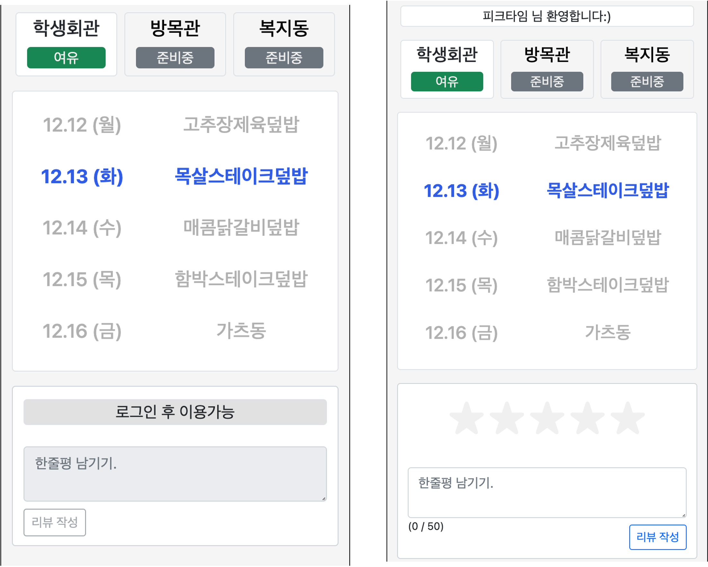
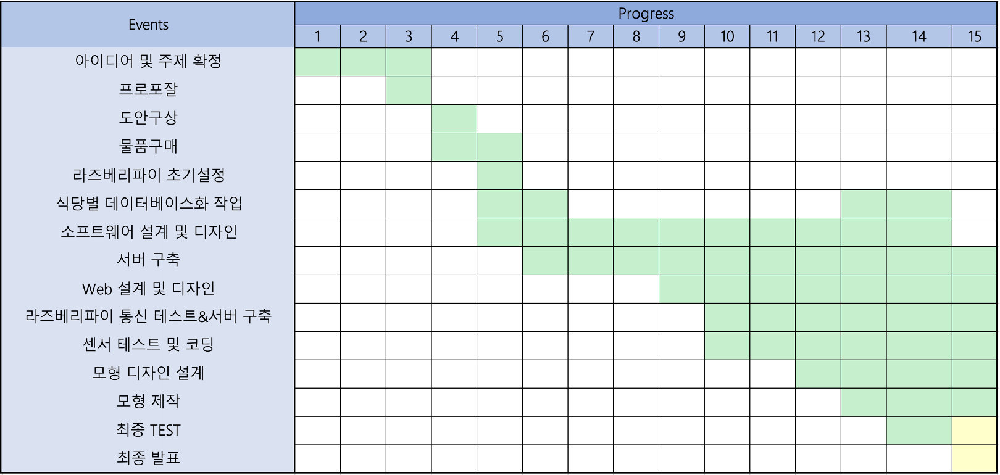

## Description

코로나 이후 본격적인 대면 수업이 재개되면서, 교내 학생들의 편의를 위해 식당이 다시 운영되기 시작했습니다. 그러나 현재 입점한 업체가 한 곳뿐이어서 교내 식당은 단 한 곳만 운영 중입니다. 대면 수업 복귀로 인해 학교에 많은 학생들이 모여들고, 한정된 식당 자원으로 인해 학생들은 긴 대기시간을 감수해야 합니다. 이로 인해 시간이 부족한 학생들은 대기열을 보고 포기해 편의점에서 대체 식사를 하거나 굶게 되는 경우도 빈번합니다. **현실적으로 식당 대기시간을 줄이기 어려운 상황에서, 미리 식당의 인구 포화도를 확인하고 목적지를 정하는 것이 학생들에게 편리함을 줄 수 있다고 생각**하여 'PeakTime' 프로젝트를 기획하게 되었습니다.

본 프로젝트는 **다양한 센서와 하드웨어 기술을 활용하여 실시간으로 식당의 인구 포화도를 측정하고, 이를 서버에 전송합니다. 서버는 이 데이터를 분석하여 학생들에게 현재 식당 상태를 알려주며, 메뉴 정보, 알람 기능 및 다양한 커뮤니티 기능과 연계**하여 학생 복지 향상에 기여할 것입니다.

피크타임 로고 by Thingk0.

 

## Environment

#### SW
- Java 11 (JDK)
- Spring Framework
- SpringSecurity
- SpringBoot
- MariaDB (now. Mysql)
- JPA (Hibernate)
- Thymeleaf

#### HW
- Arduino (uno board)
- Raspberry Pi 4
- 적외선 센서
- 비접촉식 온도 센서

#### Etc
- 파이어베이스

 

## 피크타임 전체 구성도

> 프로젝트 전체 구성도를 대략적으로 나타낸 도식입니다. 실제와는 조금 다를 수 있습니다.

식당 입장 시, **비접촉식 온도센서**를 사용하여 체온을 실시간으로 측정하고, 이를 기반으로 인원을 카운팅합니다. 측정된 데이터는 라즈베리파이를 거쳐 클라우드 서비스인 Firebase로 전송되어 처리되도록 설계되었습니다. 체온 측정 결과는 LCD 화면에 바로 표시되며, 30도 이상일 경우에만 출력되도록 설정하여 에너지를 절약하고 결과의 정확성을 확보하였습니다. 이 체온 측정 과정은 매 1초마다 반복되어 실시간 정보 전송이 가능하도록 하였습니다.

식당 퇴장 시에는 **적외선 센서**와 **1kΩ 가변저항**을 조합하여 사람이 지나갈 때마다 가변저항의 값이 변경되고, 원래의 값으로 복원되면 카운팅이 되도록 설정하였습니다. 이렇게 측정된 퇴장 인원 정보도 Firebase로 전송되어 실시간으로 통계를 제공하게 됩니다. 적외선 센서의 정확도를 높이기 위해 발광부와 수광부 사이에 상호 간섭이 최소화되도록 센서 배치를 최적화하였습니다.

이렇게 구성된 시스템을 통해 식당 입장 및 퇴장 시 인원 카운팅과 온도 측정이 실시간으로 가능하며, 이러한 데이터를 바탕으로 소프트웨어에 적용하여 학생들에게 최적의 실시간 정보를 제공합니다. 이를 통해 학생들은 식당 인원 분포와 체온 상태를 보다 쉽게 파악할 수 있게 됩니다.

 

## 식당 입장과 퇴장 실제 구성도

설계에 따라 센서들은 모두 아두이노를 통해 값을 입력받도록 구성되었습니다.
dddaa-______
 

### 실제 측정 값 확인
> 프로젝트 진행 과정에서 하드웨어 작동 여부와 데이터 전송의 정확성을 확인하기 위해 수행한 테스트로 얻어진 결과값입니다. 

센서를 통해 수집된 데이터는 아두이노를 통해 라즈베리파이로 USB 통신을 하여 전송되도록 설계되었습니다. 왼쪽 콘솔창을 통해 센서들로부터 입력받은 데이터값을 실시간으로 확인할 수 있으며, 무선랜을 이용해 데이터가 파이어베이스로 즉시 전송되기 때문에 어떤 환경에서도 데이터를 거의 실시간으로 확인할 수 있습니다.

파이어베이스에는 'in'과 'out' 두 개의 필드가 존재하며, 'in' 필드를 통해 출입 인원 수를 확인하고 'out' 필드를 통해 퇴장 인원 수를 카운트할 수 있습니다. 하드웨어는 데이터 수집의 기본 기능만 수행하므로 후처리 작업은 애플리케이션에서 자체적으로 처리하도록 구현하였습니다. 이를 통해 간단한 하드웨어 구성과 효율적인 소프트웨어 구현을 통해 학생들에게 최적화된 실시간 정보를 제공할 수 있습니다.

## 피크타임 메인 페이지
> 실제 교내에는 학생회관 외에도 교직원 및 기숙사 식당이 존재하지만, 본 프로젝트는 테스트용으로 진행되기 때문에 대표적인 학생회관 식당만 포함하였습니다. 편의를 위해 교직원 및 기숙사 식당도 추가하였으나, 프로젝트의 주 목적은 학생회관 식당에 대한 정보 제공입니다.

본 프로젝트는 주로 두 가지 역할로 구분됩니다: 식당 관리자와 일반 학생입니다. 식당 관리자는 학생들에게 메뉴 정보를 공유하기 위해 메뉴 생성, 수정, 삭제 등의 기능을 수행할 수 있는 특별한 UI/UX가 제공됩니다. 이러한 관리자 전용 기능은 관리자 계정을 통해서만 접근 가능합니다.

 

비로그인 유저의 경우 메뉴 및 식당의 현재 포화 상태 확인만 가능합니다. 그러나 로그인한 사용자에게는 오늘의 식당 메뉴에 대한 간단한 평점 및 리뷰를 남길 수 있는 환경이 제공됩니다.

## 프로젝트 진행

명지대학교 정보통신공학과 - 캡스톤 디자인
 
프로젝트 기간 : 22.09 ~ 22.12 : 약 15주

